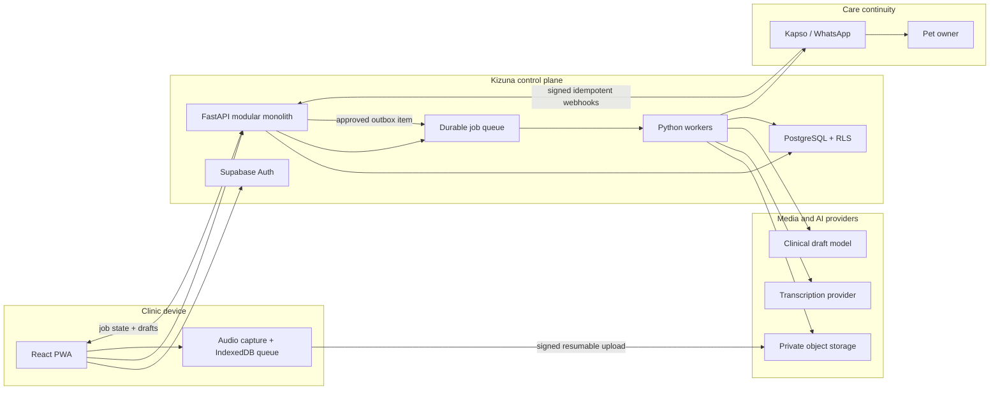

# Kizuna Production Architecture

Status: Proposed  
Date: 2026-06-10  
Initial market assumption: Nigeria, with expansion to other African markets

## Executive Decision

Kizuna should begin as a **modular monolith with asynchronous workers**, not as a
microservice platform and not as a LiveKit voice agent.

Under the solo-founder, minimal-cash constraint, Kizuna should also be
**open-source-model first with near-zero fixed infrastructure cost**. Local or
short-lived inference is preferred while usage is small. Paid APIs remain
optional benchmark challengers and emergency fallbacks, not hard dependencies.

The first production workflow is:

1. Capture audio reliably on the clinician's device.
2. Upload it without losing data on an unreliable connection.
3. Transcribe it in a background job.
4. Generate a schema-validated clinical draft with source evidence.
5. Require veterinarian review and approval.
6. Create owner communication from the approved care plan.
7. Send through Kapso only after consent and policy checks.

Use LiveKit later as a realtime media plane. Use the LiveKit Agents framework
only when Kizuna becomes an interactive participant, such as an AI receptionist
or phone agent.

## Architectural Principles

1. **The recording is durable before the AI is clever.**
2. **AI output is a versioned draft, never the source of truth.**
3. **Every clinical statement should be traceable to transcript evidence or
   marked as missing/inferred.**
4. **Tenant identity comes from authentication, never from browser input.**
5. **Slow or failed providers become job states, not lost consultations.**
6. **The database owns business invariants.**
7. **External side effects are idempotent and auditable.**
8. **Start with one deployable system; split only measured bottlenecks.**
9. **Provider abstractions protect continuity, but premature multi-provider
   complexity is avoided.**
10. **Clinical quality is measured with veterinarian-reviewed evaluations, not
    generic language-model benchmarks.**

## Should Kizuna Use LiveKit?

### For the first Scribe release: no

The Scribe is initially a passive documentation workflow. It does not need
turn-taking, text-to-speech, interruption handling, telephony, or an autonomous
agent loop.

For this release, use:

- browser `MediaRecorder` or an `AudioWorklet`;
- local chunk persistence in IndexedDB;
- resumable direct-to-object-storage uploads;
- a durable background queue;
- asynchronous transcription and note generation.

This is cheaper, easier to debug, more tolerant of weak connectivity, and gives
the clinic a clear recovery path after tab, network, or provider failure.

### When LiveKit becomes justified

Adopt **LiveKit Cloud as the media plane** when one or more of these are proven
requirements:

- clinicians require partial live transcripts;
- multiple people/devices join one consultation;
- browser microphone handling needs robust WebRTC reconnection;
- Kizuna records or summarizes phone calls;
- a remote specialist joins the visit;
- the product adds an AI receptionist or interactive voice assistant.

For live transcription, Kizuna can use a LiveKit room and a server-side worker
that subscribes to the clinician's audio. This does not require the full
conversational agent stack.

### When to use LiveKit Agents

Use LiveKit Agents for:

- phone or browser voice conversations;
- turn detection and interruption handling;
- tool-calling during a conversation;
- streaming STT -> LLM -> TTS pipelines;
- SIP/telephony integration;
- an AI receptionist that is expected to respond in realtime.

Do not use it merely because the product contains audio.

See [ADR 001](adr/001-livekit-boundary.md).

## Target System



## Deployment Shape

Start with four deployable units:

1. **Web**
   - React/Vite PWA.
   - Static deployment behind a CDN.
   - Public landing and authenticated app should be lazy-loaded separately.

2. **API**
   - FastAPI.
   - Stateless request handling.
   - Authentication, authorization, CRUD, signed upload creation, job status,
     note review, and webhook ingress.

3. **Worker**
   - Same Python repository and domain modules as the API.
   - Separate process/container.
   - Handles transcription, note generation, OCR, exports, and WhatsApp outbox.

4. **Managed state**
   - Supabase Auth and PostgreSQL.
   - Private object storage.
   - Managed durable queue.

Do not introduce Kubernetes. A solo founder benefits more from managed compute,
immutable containers, health checks, and one-command rollback.

## Recommended Initial Stack

| Concern | Recommendation | Reason |
| --- | --- | --- |
| Frontend | React PWA | Existing code, mobile capture, installability |
| API | FastAPI | Existing code and strong typed Python ecosystem |
| Auth | Supabase Auth | Already integrated |
| Database | Supabase PostgreSQL | Existing schema, RLS, backups |
| Queue | Supabase Queues initially | PostgreSQL-native durability and low operational load |
| Worker | Python worker process | Reuses domain code and AI SDKs |
| Storage | Private Supabase Storage initially | Signed/resumable uploads and tenant policies |
| Realtime media | None in P0; LiveKit Cloud when proven | Avoid premature media infrastructure |
| Transcription | Provider adapter; evaluate Deepgram first | Streaming support and keyterm prompting |
| Transcription baseline | faster-whisper locally | Open model, quantized CPU/GPU execution |
| Transcription challenger | Provider adapter or rented GPU run | Compare quality without permanent spend |
| Note generation | Quantized 4B-9B open instruction model | Local schema-constrained drafts |
| Local model runtime | llama.cpp or Ollama | Minimal operational and hardware requirements |
| WhatsApp | Kapso | Already integrated with signed webhooks |
| Errors | Sentry | Fast feedback for a solo operator |
| Telemetry | OpenTelemetry conventions | Portable traces, logs, and metrics |
| Product analytics | Privacy-limited event analytics | Understand workflow without copying clinical text |

### Region decision

Choose one primary data region and document it contractually. Measure latency
from actual pilot clinics before optimizing by intuition.

If African data residency is a hard requirement, compare providers that can
keep database, object storage, backups, and compute in an African region.
AWS documents an Africa (Cape Town) region. Supabase's available project
regions must be checked at provisioning time; do not claim local residency when
the complete data path is not local.

Do not split one patient's data across regions during the pilot.

## Audio Capture Architecture

### Device-side state machine

```text
idle
  -> consent_confirmed
  -> recording
  -> paused
  -> recording
  -> stopped
  -> upload_pending
  -> uploading
  -> uploaded
  -> processing
  -> draft_ready
  -> reviewed
  -> finalized
```

Every transition is persisted locally and remotely where possible.

### Capture rules

- Prefer Opus audio in WebM/Ogg where browser support allows.
- Record in small chunks rather than one large in-memory blob.
- Store chunks in IndexedDB before network transmission.
- Include sequence number, session ID, codec, sample rate, duration, and SHA-256.
- Never delete the local copy until the server confirms object integrity.
- Cap recording duration and warn before device storage becomes unsafe.
- Detect microphone permission loss and input-device changes.
- Allow the clinician to continue recording during temporary network loss.

### Upload rules

1. Client requests an upload session from FastAPI.
2. API authorizes clinic/patient access and creates `recording_session`.
3. API returns a short-lived signed resumable upload target.
4. Browser uploads directly to private storage.
5. Client calls `complete` with object metadata and checksum.
6. API validates ownership and enqueues transcription exactly once.

Audio bytes should not flow through the FastAPI web process unless there is a
measured reason. Direct uploads reduce memory pressure, request timeouts, and
compute bandwidth.

### Optional LiveKit path

When live captions are required:

- API issues a short-lived LiveKit room token with clinic/session metadata.
- Browser publishes one audio track.
- A Kizuna transcription worker subscribes to it.
- Partial transcript events return over a data channel or application stream.
- Durable recording still goes to private object storage.
- Final notes are generated from the durable final transcript, not only partial
  websocket events.

Realtime state is an experience enhancement. It must not become the only copy
of the clinical encounter.

## Asynchronous Processing

### Job types

- `recording.transcribe`
- `transcript.normalize`
- `note.generate`
- `note.evaluate`
- `document.ocr`
- `record.export`
- `whatsapp.send`
- `retention.delete`

### Job envelope

Every job contains:

```json
{
  "job_id": "uuid",
  "job_type": "recording.transcribe",
  "clinic_id": "uuid",
  "subject_id": "uuid",
  "attempt": 1,
  "idempotency_key": "recording-id:transcription-version",
  "trace_id": "trace-id",
  "created_at": "timestamp"
}
```

Workers must:

- claim jobs with visibility timeouts;
- renew leases for long work;
- use bounded retries with jitter;
- classify retryable and terminal failures;
- move exhausted jobs to a dead-letter state;
- be safe to run more than once;
- record provider request IDs, latency, usage, and cost.

Do not perform transcription, OCR, campaign fan-out, or model generation inside
an HTTP request.

## Transcription Provider Strategy

Build one interface:

```python
class Transcriber(Protocol):
    async def transcribe(
        self,
        audio_uri: str,
        *,
        language: str,
        vocabulary: list[str],
        diarize: bool,
    ) -> TranscriptResult: ...
```

`TranscriptResult` should include:

- full text;
- timed utterances;
- speaker labels when available;
- word confidence where available;
- detected language;
- provider/model/version;
- warnings and partial-failure information;
- provider request ID;
- duration and billable units.

### Provider selection

Do not choose from marketing claims. Run a veterinary benchmark using:

- Nigerian and other target-market accents;
- noisy consultation rooms;
- pet names and owner names;
- veterinary drugs, procedures, breeds, and anatomy;
- code-switching seen in real clinics;
- negation and dosage statements.

Evaluate:

- word error rate;
- medical-term error rate;
- negation error rate;
- speaker attribution;
- latency;
- failure rate;
- cost per consultation.

Deepgram is a reasonable first candidate because its current platform supports
streaming transcription and keyterm prompting. Keep the adapter boundary so a
second provider can be tested or used during incidents.

For the minimal-cash path, faster-whisper is the default baseline and Deepgram
is a paid benchmark challenger or fallback. Production selection is based on
target-clinic evaluation, not vendor status.

## Clinical Note Generation

### Two-stage pipeline

Do not ask one model to turn raw audio directly into a final note.

1. **Transcript normalization**
   - speaker turns;
   - timestamps;
   - terminology normalization without changing meaning;
   - explicit uncertain/inaudible segments;
   - no clinical inference.

2. **Structured note generation**
   - validated JSON schema;
   - required evidence references;
   - missing-field list;
   - contradiction list;
   - uncertainty flags;
   - owner-summary draft kept separate from the medical note.

Example shape:

```json
{
  "subjective": {
    "text": "...",
    "evidence": [{"start_ms": 12000, "end_ms": 17800}]
  },
  "objective": {
    "text": "...",
    "evidence": []
  },
  "assessment": {
    "text": "...",
    "requires_clinician_confirmation": true
  },
  "plan": {
    "text": "...",
    "evidence": [{"start_ms": 94000, "end_ms": 112000}]
  },
  "missing_information": ["temperature", "weight"],
  "warnings": []
}
```

### Version everything

Persist:

- transcript version;
- prompt version;
- note schema version;
- model and provider;
- generation parameters;
- source object IDs;
- generated draft;
- clinician edits;
- approving user and timestamp.

Never overwrite the generated draft with the edited note. Store note versions
and an edit diff. This becomes the foundation of quality evaluation.

### Safety constraints

- No autonomous diagnosis or prescribing.
- Medication doses must be copied from evidence or explicitly marked missing.
- Preserve negation.
- Reject cross-patient context.
- Uploaded documents are untrusted data, not instructions.
- Provider/model changes require an evaluation run.
- Clinically significant incidents need review and rollback.

## Core Data Model

Add these bounded areas to the existing tenant model:

### Clinical encounter

- `encounters`
- `recording_sessions`
- `recording_parts`
- `transcript_versions`
- `transcript_utterances`
- `note_versions`
- `note_evidence`
- `note_approvals`
- `clinical_templates`
- `consent_events`

### Processing

- `jobs`
- `job_attempts`
- `provider_calls`
- `outbox_events`

### Audit and operations

- `audit_events`
- `retention_policies`
- `data_export_requests`
- `deletion_requests`
- `safety_reports`

Every business row must include `clinic_id`. Patient-bound rows also include
`pet_id`. Immutable records such as approval and audit events should be
append-only.

## Tenant Isolation

The current backend uses the Supabase service-role key, which bypasses RLS, and
then manually adds `clinic_id` filters. That is a useful first boundary but a
dangerous long-term default: one missed filter can expose another clinic.

Recommended progression:

1. Keep explicit `clinic_id` filters.
2. Add automated cross-tenant tests for every repository function.
3. Move writes that span tables into PostgreSQL functions/transactions.
4. Where practical, execute database requests using the user's JWT so RLS is
   active.
5. For service processes, use narrowly scoped database roles or security
   definer functions rather than a universal service-role client.
6. Keep worker jobs tenant-scoped and verify the subject belongs to the clinic
   before every provider call or side effect.

Never accept `clinic_id` from a public request body.

## WhatsApp and Kapso

Kapso is a transport and event layer, not the source of clinical truth.

Use an outbox:

1. Clinician approves the owner summary/follow-up.
2. Transaction creates an immutable approval and `outbox_event`.
3. Worker checks consent, opt-out, template/window policy, and clinic number.
4. Worker sends through Kapso using an idempotency key.
5. Signed webhooks update delivery state.
6. Failures are visible and retryable.

Do not call Kapso directly inside the same request that finalizes the clinical
note. Database success and external-message success cannot be atomic; the
outbox pattern closes that gap.

## API Boundaries

Suggested route groups:

```text
/api/auth/*
/api/clinics/*
/api/patients/*
/api/encounters/*
/api/recordings/*
/api/transcripts/*
/api/notes/*
/api/templates/*
/api/consents/*
/api/whatsapp/*
/api/webhooks/*
/api/admin/jobs/*
```

Use request IDs and idempotency keys on state-changing routes.

Do not expose provider-specific concepts such as Deepgram request fields or
model prompt internals in the public API.

## Reliability Targets

Pilot targets:

- No acknowledged recording loss.
- 99.5% monthly API availability.
- 95% of completed uploads produce a draft without manual intervention.
- P95 API latency below 500 ms for non-AI requests.
- P95 upload-to-draft time measured and shown honestly.
- Webhook duplicate processing rate: zero.
- Cross-tenant access test failures: zero.

Define:

- RPO: how much committed data can be lost.
- RTO: how long recovery may take.
- maximum tolerable unprocessed queue age.
- recording and transcript retention by clinic policy.

## Observability

Use one correlation chain:

```text
browser_session_id
  -> request_id
  -> encounter_id
  -> job_id
  -> provider_request_id
  -> whatsapp_message_id
```

### Logs

Structured JSON only in production. Include:

- timestamp and deployment version;
- environment;
- trace/request/job ID;
- clinic ID in a non-public internal field;
- operation and status;
- latency and provider;
- safe error classification.

Never log:

- transcript text;
- clinical notes;
- audio URLs;
- owner phone numbers;
- access tokens;
- raw webhook payloads without redaction.

### Metrics

- recording starts/completions/abandonments;
- upload retries and failures;
- queue age and depth;
- transcription latency/failure/cost;
- draft generation latency/failure/cost;
- note edit distance and approval rate;
- webhook lag and message failure;
- active clinicians and finalized notes.

### Tracing

Instrument FastAPI, worker jobs, database calls, storage operations, and
provider calls using OpenTelemetry conventions. Send exceptions and release
information to Sentry.

## Security and Privacy

- Obtain jurisdiction-specific recording consent.
- Treat audio, transcript, and clinical notes as sensitive data.
- Use private buckets and short-lived signed URLs.
- Separate production, staging, and development projects.
- Use a managed secret store and rotate credentials.
- Require MFA for clinic owners/admins.
- Add rate limits to auth, upload creation, AI generation, and messaging.
- Validate MIME type, codec, duration, and file size.
- Scan uploaded documents.
- Add security headers and a strict CSP.
- Make deletion a background workflow with an audit record.
- Test backup restoration, not only backup creation.
- Maintain a subprocessors and data-location register.
- Obtain Nigerian legal review against the Nigeria Data Protection Act and NDPC
  guidance before processing real clinic data.

## Cost Model

Meter per clinic:

- recorded minutes;
- stored audio GB-days;
- transcription seconds;
- input/output model tokens;
- OCR pages;
- WhatsApp conversations/templates;
- worker compute time.

Set:

- per-clinic soft and hard limits;
- provider budget alerts;
- maximum recording duration;
- maximum automatic retries;
- a global AI/messaging kill switch.

Do not offer unlimited audio before observing real usage.

## Current Repository Gaps

The current code has useful foundations:

- FastAPI;
- Supabase authentication;
- tenant memberships and role checks;
- explicit clinic filters;
- RLS schema;
- Kapso signed webhooks and event idempotency;
- WhatsApp account isolation;
- React dashboard and Scribe UX prototype.

Before real Scribe pilots, it still needs:

- persistent encounter/note/audio schemas;
- actual browser recording and recovery;
- private resumable uploads;
- a durable queue and worker;
- transcription and structured note adapters;
- note versioning, evidence, and approvals;
- consent records;
- outbox-based messaging;
- audit logs;
- production deployment definitions;
- CI, tests, monitoring, backup restore, and incident runbooks.

Also remove unrelated Telegram startup from the API lifespan unless it is an
intentional production subsystem. Background bots should not share failure and
deployment lifecycle with the HTTP API.

## Build Sequence for a Solo Founder

### Milestone 1: Durable vertical slice

- Encounter schema and states.
- Consent event.
- Browser recording to local chunks.
- Private resumable upload.
- Queue and worker.
- One transcription provider.
- One SOAP schema and template.
- Draft review and approval.
- No realtime transcript.

Exit: ten real consented consultations complete without lost audio.

### Milestone 2: Clinical quality

- Evidence-linked note fields.
- Missing/uncertain information display.
- Versioned prompts/models.
- Clinician edit capture.
- Veterinary evaluation harness.
- Incident report action.

Exit: veterinarian-agreed thresholds for significant omissions and errors.

### Milestone 3: Care continuity

- Owner summary from approved note.
- Consent and opt-out checks.
- Outbox worker.
- Kapso templates and delivery states.
- Follow-up task creation.

Exit: approved notes reliably produce trackable care actions.

### Milestone 4: Clinic operations

- Invitations and membership management.
- Audit log.
- exports and deletion;
- retention settings;
- onboarding and spreadsheet migration;
- billing and usage metering.

### Milestone 5: Realtime only if demanded

- Run a LiveKit Cloud spike.
- Measure latency, reconnection, bandwidth, and total cost in target clinics.
- Add partial transcripts while preserving durable local recording.
- Keep asynchronous final transcription as the canonical source.

### Milestone 6: Interactive voice

- LiveKit Agents for AI receptionist/phone workflows.
- Strict tool permissions.
- Human handoff.
- Call disclosure/consent.
- Conversation evaluations and spend caps.

## Engineering Knowledge to Master

To operate this system confidently, study:

1. HTTP semantics, idempotency, retries, and timeouts.
2. PostgreSQL transactions, indexes, locks, RLS, and migrations.
3. Queue leases, at-least-once delivery, dead letters, and outbox patterns.
4. Browser audio APIs, codecs, WebRTC, and unreliable-network recovery.
5. Object storage, multipart/resumable uploads, signed URLs, and retention.
6. Structured model outputs, evaluation sets, prompt/model versioning.
7. OAuth/JWT/session security and tenant authorization.
8. OpenTelemetry traces, RED metrics, SLOs, and incident response.
9. Container builds, immutable deployment, rollback, and backup restore.
10. Threat modeling, privacy engineering, and clinical safety.

The goal is not to memorize vendors. It is to understand the invariants so a
vendor can be replaced without redesigning Kizuna.

## Research and Dataset Strategy

Kizuna may create a meaningful African veterinary speech and clinical
documentation research contribution. Product use, internal quality evaluation,
model training, publication, and public data release require separate consent
scopes.

Do not claim novelty until a systematic literature and dataset review confirms
it. Split evaluation data by clinic and speaker, preserve a locked test set,
report subgroup results, and measure safety-critical errors beyond WER.

The complete open-source model ladder, dataset governance, annotation protocol,
evaluation design, publication options, and twelve-week research plan are in
[OPEN_SOURCE_RESEARCH_PLAN.md](OPEN_SOURCE_RESEARCH_PLAN.md).

## Primary References

- [LiveKit Agents](https://docs.livekit.io/agents/)
- [LiveKit self-hosting and deployment](https://docs.livekit.io/home/self-hosting/deployment/)
- [LiveKit end-to-end encryption](https://docs.livekit.io/home/client/tracks/encryption/)
- [OpenAI Realtime transcription](https://platform.openai.com/docs/guides/realtime-transcription)
- [OpenAI Structured Outputs](https://platform.openai.com/docs/guides/structured-outputs)
- [OpenAI API data controls](https://platform.openai.com/docs/guides/your-data)
- [Deepgram live streaming](https://developers.deepgram.com/docs/getting-started-with-live-streaming-audio)
- [Deepgram keyterm prompting](https://developers.deepgram.com/docs/keyterm)
- [OpenAI Whisper](https://github.com/openai/whisper)
- [faster-whisper](https://github.com/SYSTRAN/faster-whisper)
- [llama.cpp](https://github.com/ggml-org/llama.cpp)
- [Hugging Face PEFT](https://github.com/huggingface/peft)
- [Data Statements for NLP](https://aclanthology.org/Q18-1041/)
- [Supabase Queues](https://supabase.com/docs/guides/queues)
- [Supabase resumable uploads](https://supabase.com/docs/guides/storage/uploads/resumable-uploads)
- [Supabase Row Level Security](https://supabase.com/docs/guides/database/postgres/row-level-security)
- [AWS Regions](https://docs.aws.amazon.com/global-infrastructure/latest/regions/aws-regions.html)
- [Kapso webhooks](https://docs.kapso.ai/docs/platform/webhooks/overview)
- [Kapso webhook security](https://docs.kapso.ai/docs/platform/webhooks/security)
- [OpenTelemetry Python](https://opentelemetry.io/docs/languages/python/)
- [Sentry FastAPI integration](https://docs.sentry.io/platforms/python/integrations/fastapi/)
- [Nigeria Data Protection Commission](https://ndpc.gov.ng/)
